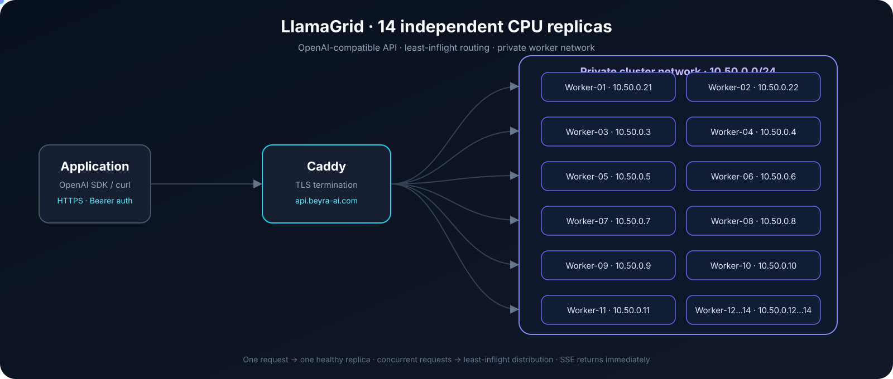
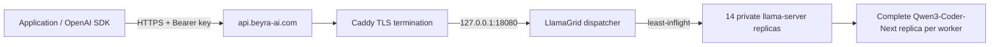
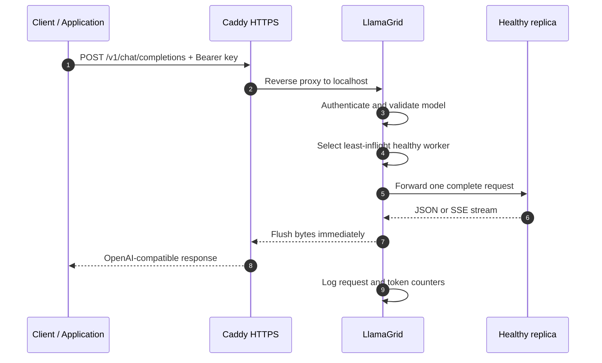

# LlamaGrid — Production OpenAI-Compatible Inference Grid

[](https://api.beyra-ai.com/v1)
[](https://github.com/BehnamJalaliCo/LLAMA-Grid)
[](https://api.beyra-ai.com/health)
[](LICENSE)

> A production-oriented request-level inference grid built on `ik_llama.cpp`: fourteen complete CPU replicas, least-inflight routing, an OpenAI-compatible API, HTTPS termination, health-aware admission, structured logs, metrics, and immediate SSE streaming.

> یک شبکه‌ی inference عملیاتی و قابل‌توسعه بر پایه‌ی `ik_llama.cpp`: چهارده replica کامل CPU، مسیریابی least-inflight، API سازگار با OpenAI، HTTPS، health-aware admission، لاگ ساخت‌یافته، metrics و SSE فوری.

## Executive summary · خلاصه‌ی اجرایی

### English

LlamaGrid is a production architecture built around this repository for serving any compatible llama-server model. The current deployment uses **Qwen3-Coder-Next 80B Q4_K_M** as one configured profile, but the dispatcher and control plane do not require that model. Each worker owns a complete model replica. The dispatcher assigns each request to one healthy replica and never splits one request across workers. This makes the system predictable, observable, and horizontally scalable for concurrent requests.

The public contract is OpenAI-compatible. Clients use `https://api.beyra-ai.com/v1`, authenticate with a Bearer key, and call `/v1/models`, `/v1/chat/completions`, or `/v1/completions`. Caddy terminates TLS on Model-Hub; the dispatcher is localhost-only; workers remain private.

### فارسی

LlamaGrid معماری production این repository برای سرویس‌دهی به **Qwen3-Coder-Next 80B Q4_K_M** است. هر Worker یک replica کامل از مدل دارد. Dispatcher هر درخواست را به یک replica سالم اختصاص می‌دهد و هیچ درخواست واحدی را بین Workerها تقسیم نمی‌کند. نتیجه، سیستمی قابل‌پیش‌بینی، قابل‌مشاهده و قابل‌گسترش برای درخواست‌های هم‌زمان است.

قرارداد عمومی با OpenAI سازگار است. کلاینت به `https://api.beyra-ai.com/v1` وصل می‌شود، با Bearer key احراز هویت می‌کند و از `/v1/models`، `/v1/chat/completions` یا `/v1/completions` استفاده می‌کند. Caddy روی Model-Hub TLS را terminate می‌کند، dispatcher فقط localhost است و Workerها خصوصی باقی می‌مانند.

## Current deployment · وضعیت فعلی

| Dimension | Current value | شرح فارسی |
|---|---|---|
| Public base URL | `https://api.beyra-ai.com/v1` | آدرس عمومی سرویس |
| External model ID | `qwen3-coder-next` | نام مدل عمومی |
| Model | Qwen3-Coder-Next 80B, `Q4_K_M` | مدل کامل روی هر replica |
| Dispatcher | `127.0.0.1:18080` | dispatcher فقط روی Hub |
| Public edge | Caddy on `80/443` | TLS و reverse proxy |
| Backends | 14 independent `llama-server` replicas | چهارده replica مستقل |
| Routing | Least-inflight among healthy workers | کمترین بار در میان سالم‌ها |
| Placement | One request → one replica | هر درخواست روی یک replica |
| Auth | `Authorization: Bearer <API_KEY>` | احراز هویت Bearer |
| Streaming | SSE, no full-response buffering | streaming فوری |
| Services | `llamagrid-api.service` + `caddy.service` | سرویس‌های دائمی |

## Operator control plane · پنل مدیریت

The repository now includes a separate production control plane under
[`control_plane/`](control_plane/). It is an operations layer around the
existing inference data plane: it does not replace the dispatcher and does
not change worker performance tuning.

| Layer | Production choice | Scope |
|---|---|---|
| API | FastAPI + Uvicorn | Auth, inventory, model catalog, deployments, jobs, SSE chat, metrics |
| Database | PostgreSQL with a TimescaleDB-compatible image | Durable state; future high-volume metrics hypertables |
| Jobs | Celery + Redis | Observable provisioning and rolling deployment state machines |
| UI | Next.js 16 + TypeScript | Dashboard, chat playground, model/server/deployment/key screens |
| Security | Argon2 passwords, encrypted provider tokens, hashed API keys | Secrets stay server-side and are never logged |
| Runtime | Docker Compose + systemd + Caddy | Reproducible service lifecycle and HTTPS routing |

The panel is served at `https://beyra-ai.com`; the existing inference API
remains at `https://api.beyra-ai.com/v1`. Panel-generated keys can also call
the OpenAI-compatible gateway at `https://beyra-ai.com/v1` without exposing
the dispatcher’s internal key to a browser.

این repository یک Control Plane production در مسیر
[`control_plane/`](control_plane/) دارد. این پنل لایه‌ی عملیاتی اطراف data plane
فعلی است؛ dispatcher و tuning مربوط به Workerها را جایگزین یا تغییر نمی‌دهد.

| لایه | انتخاب production | محدوده |
|---|---|---|
| API | FastAPI + Uvicorn | احراز هویت، inventory، catalog مدل، deployment، job، chat و metrics |
| دیتابیس | PostgreSQL با image سازگار با TimescaleDB | state پایدار و آماده‌ی metrics حجیم |
| صف کار | Celery + Redis | اجرای قابل‌مشاهده‌ی provisioning و rolling deployment |
| پنل | Next.js + TypeScript | داشبورد، chat، مدل، سرور، deployment و API key |
| امنیت | Argon2، رمزنگاری tokenها و hash کردن API key | secretها فقط در backend می‌مانند |
| اجرا | Docker Compose + systemd + Caddy | lifecycle تکرارپذیر و HTTPS |

پنل روی `https://beyra-ai.com` و API inference فعلی روی
`https://api.beyra-ai.com/v1` باقی می‌ماند. API keyهای ساخته‌شده در پنل، gateway
سازگار با OpenAI در `https://beyra-ai.com/v1` را بدون افشای key داخلی dispatcher
قابل استفاده می‌کنند.

## Live architecture · معماری زنده

<p align="center">
  
</p>

The animated SVG is a repository asset, not an external dependency. It can be replaced later without changing the API contract.

این SVG متحرک داخل repository نگه‌داری می‌شود و dependency خارجی نیست؛ در آینده بدون تغییر قرارداد API قابل‌تعویض است.



### Core decisions · تصمیم‌های اصلی

| Principle | English decision | تصمیم فارسی |
|---|---|---|
| Isolation | One complete replica serves one request. | هر درخواست روی یک replica کامل اجرا می‌شود. |
| Predictability | No production cross-worker tensor movement. | در مسیر production کپی tensor بین Workerها نداریم. |
| Scale-out | More replicas increase concurrent-request capacity. | افزودن replica ظرفیت درخواست هم‌زمان را زیاد می‌کند. |
| Safety | Only Caddy is public; workers are private. | فقط Caddy عمومی است؛ Workerها خصوصی‌اند. |
| Recovery | Failed workers leave selection and recovered workers re-enter. | Worker خراب خارج و Worker بازیابی‌شده دوباره وارد می‌شود. |
| Extensibility | Explicit backends, API, metrics, and service files. | backend، API، metrics و service صریح و قابل‌تغییرند. |

## Request lifecycle · چرخه‌ی درخواست



### Routing and recovery

1. Startup probes all configured workers.
2. Only healthy workers participate in selection.
3. The lowest in-flight count wins; ties rotate fairly.
4. Transport failures and backend HTTP 5xx responses mark a worker unhealthy.
5. A background health loop probes every five seconds and re-admits recovered workers.
6. `/ready` returns HTTP 200 only when all fourteen workers pass direct checks.
7. SSE bytes are forwarded immediately; the dispatcher does not wait for the full answer.

### مسیریابی و بازیابی

۱. در startup همه‌ی Workerها probe می‌شوند.
۲. فقط Workerهای سالم در انتخاب شرکت می‌کنند.
۳. کمترین in-flight انتخاب می‌شود و در تساوی rotation انجام می‌شود.
۴. خطای شبکه و HTTP 5xx، Worker را unhealthy می‌کند.
۵. health loop هر پنج ثانیه Worker بازیابی‌شده را دوباره وارد می‌کند.
۶. `/ready` فقط وقتی HTTP 200 می‌دهد که هر چهارده Worker سالم باشند.
۷. chunkهای SSE فوری forward می‌شوند و پاسخ کامل buffer نمی‌شود.

## Cluster topology · توپولوژی cluster

### Model-Hub

| Node | Private address | Role | Listening surface |
|---|---:|---|---|
| Model-Hub | `10.50.0.2` | Caddy + dispatcher | `*:80`, `*:443`, `127.0.0.1:18080` |

### Worker replicas

All workers use the same compatible binary, model files, and stable runtime policy:
`-t 24 -tb 24 -c 4096 -b 2048 -ub 1024 -np 1 -fa 1 -gr`.

همه‌ی Workerها از binary، model files و runtime policy یکسان استفاده می‌کنند:
`-t 24 -tb 24 -c 4096 -b 2048 -ub 1024 -np 1 -fa 1 -gr`.

| Worker | Private IP | Port | Hardware | Loaded state |
|---|---:|---:|---|---|
| Worker-01 | `10.50.0.21` | `8080` | AMD EPYC Milan · 24P/48L · 1 NUMA | 79.674B · ~45.081 GiB |
| Worker-02 | `10.50.0.22` | `8080` | AMD EPYC Milan · 24P/48L · 1 NUMA | 79.674B · ~45.081 GiB |
| Worker-03 | `10.50.0.3` | `8080` | AMD EPYC Milan · 24P/48L · 1 NUMA | 79.674B · ~45.081 GiB |
| Worker-04 | `10.50.0.4` | `8080` | AMD EPYC Milan · 24P/48L · 1 NUMA | 79.674B · ~45.081 GiB |
| Worker-05 | `10.50.0.5` | `8080` | AMD EPYC Milan · 24P/48L · 1 NUMA | 79.674B · ~45.081 GiB |
| Worker-06 | `10.50.0.6` | `8080` | AMD EPYC Milan · 24P/48L · 1 NUMA | 79.674B · ~45.081 GiB |
| Worker-07 | `10.50.0.7` | `8080` | AMD EPYC Milan · 24P/48L · 1 NUMA | 79.674B · ~45.081 GiB |
| Worker-08 | `10.50.0.8` | `8080` | AMD EPYC Milan · 24P/48L · 1 NUMA | 79.674B · ~45.081 GiB |
| Worker-09 | `10.50.0.9` | `8080` | AMD EPYC Milan · 24P/48L · 1 NUMA | 79.674B · ~45.081 GiB |
| Worker-10 | `10.50.0.10` | `8080` | AMD EPYC Milan · 24P/48L · 1 NUMA | 79.674B · ~45.081 GiB |
| Worker-11 | `10.50.0.11` | `8080` | AMD EPYC Milan · 24P/48L · 1 NUMA | 79.674B · ~45.081 GiB |
| Worker-12 | `10.50.0.12` | `8080` | AMD EPYC Milan · 24P/48L · 1 NUMA | 79.674B · ~45.081 GiB |
| Worker-13 | `10.50.0.13` | `8080` | AMD EPYC Milan · 24P/48L · 1 NUMA | 79.674B · ~45.081 GiB |
| Worker-14 | `10.50.0.14` | `8080` | AMD EPYC Milan · 24P/48L · 1 NUMA | 79.674B · ~45.081 GiB |

> **Replica trade-off:** full replicas maximize concurrent-request throughput and avoid graph-over-RPC decode barriers, but multiply model memory. A single request still uses one worker.
>
> **trade-off replica:** replica کامل throughput درخواست‌های هم‌زمان را بالا می‌برد و barrierهای graph-over-RPC را حذف می‌کند، اما مصرف حافظه را چند برابر می‌کند. هر درخواست واحد همچنان روی یک Worker است.

### Provisioning record · سابقه‌ی provision

| Item | Recorded state |
|---|---|
| Worker-03…14 infrastructure | Hetzner `ccx63`, Ubuntu 24.04, private cluster network |
| Runtime dependency | `libgomp1` installed where required |
| Model distribution | Four GGUF shards synchronized to every replica; each new node received 48,410,992,032 bytes |
| Binary consistency | `llama-server`, `libllama.so`, `libggml.so`, and `libmtmd.so` hashes matched across Hub and workers |
| Legacy RPC surface | RPC port `50052` stopped; final production data plane uses HTTP replica endpoints on private `8080` |

این جدول شواهد زیرساختی را برای reproducibility نگه می‌دارد: nodeهای جدید با image یکسان، dependency یکسان، shardهای کامل و binaryهای hash-matched وارد fleet شدند.

## Public API · API عمومی

Base URL: `https://api.beyra-ai.com/v1`

| Method | Endpoint | Auth | Purpose |
|---|---|---|---|
| `GET` | `/health` | Public | Dispatcher status and in-flight state |
| `GET` | `/ready` | Public | Direct check of all 14 workers |
| `GET` | `/metrics` | Bearer key | Prometheus-style counters and backend state |
| `GET` | `/v1/models` | Bearer key | OpenAI model discovery |
| `POST` | `/v1/chat/completions` | Bearer key | Chat JSON or SSE |
| `POST` | `/v1/completions` | Bearer key | Text completion JSON or SSE |

| متد | Endpoint | احراز هویت | کاربرد |
|---|---|---|---|
| `GET` | `/health` | عمومی | وضعیت dispatcher و in-flight |
| `GET` | `/ready` | عمومی | بررسی هر ۱۴ Worker |
| `GET` | `/metrics` | Bearer key | متریک و وضعیت backend |
| `GET` | `/v1/models` | Bearer key | کشف مدل |
| `POST` | `/v1/chat/completions` | Bearer key | chat معمولی یا SSE |
| `POST` | `/v1/completions` | Bearer key | text completion معمولی یا SSE |

### Authentication · احراز هویت

The API secret is intentionally absent from Git. It is stored on the production host at `/etc/llamagrid/api.env` with mode `600` and loaded by systemd. Never place the value in this README, a commit, a command line, or a public issue.

secret عمداً در Git نیست و روی host در `/etc/llamagrid/api.env` با mode `600` نگه‌داری و توسط systemd بارگذاری می‌شود. مقدار آن را در README، commit، command line یا issue عمومی قرار ندهید.

```bash
export LLAMAGRID_API_KEY='<read from /etc/llamagrid/api.env>'
```

### Model discovery · کشف مدل

```bash
curl -sS https://api.beyra-ai.com/v1/models \
  -H "Authorization: Bearer $LLAMAGRID_API_KEY"
```

### Non-streaming chat · chat بدون streaming

```bash
curl -sS https://api.beyra-ai.com/v1/chat/completions \
  -H "Authorization: Bearer $LLAMAGRID_API_KEY" \
  -H "Content-Type: application/json" \
  -d '{
    "model":"qwen3-coder-next",
    "messages":[{"role":"user","content":"Write a short Python hello world program."}],
    "stream":false,
    "max_tokens":128
  }'
```

### Streaming chat · chat به‌صورت streaming

```bash
curl -N https://api.beyra-ai.com/v1/chat/completions \
  -H "Authorization: Bearer $LLAMAGRID_API_KEY" \
  -H "Content-Type: application/json" \
  -d '{
    "model":"qwen3-coder-next",
    "messages":[{"role":"user","content":"Write a short Python hello world program."}],
    "stream":true,
    "max_tokens":128
  }'
```

The response is SSE: each `data:` frame is flushed immediately and the stream ends with `data: [DONE]`.

پاسخ SSE است؛ هر frame با `data:` فوری flush می‌شود و stream با `data: [DONE]` پایان می‌یابد.

### Text completion · تکمیل متن

```bash
curl -sS https://api.beyra-ai.com/v1/completions \
  -H "Authorization: Bearer $LLAMAGRID_API_KEY" \
  -H "Content-Type: application/json" \
  -d '{
    "model":"qwen3-coder-next",
    "prompt":"Write one concise Python function that adds two integers.",
    "stream":false,
    "max_tokens":64
  }'
```

## Operations · عملیات

### Repository and host files · فایل‌های repository و host

| Path | Responsibility | مسئولیت فارسی |
|---|---|---|
| `tools/qwen_replica_dispatcher.py` | Auth, OpenAI routes, routing, SSE, health, metrics, logs | dispatcher اصلی |
| `docs/llamagrid/architecture.svg` | Animated architecture asset | asset انیمیشن |
| `/etc/llamagrid/api.env` | Host-only API secret; never commit | secret فقط روی host |
| `/etc/systemd/system/llamagrid-api.service` | Persistent dispatcher | سرویس دائمی |
| `/etc/caddy/Caddyfile` | HTTPS reverse proxy | reverse proxy و TLS |
| `/opt/models/qwen3-coder-next/` | Four-file GGUF model split | shardهای مدل |

### Stable worker policy · policy پایدار Worker

```bash
/opt/ik_llama.cpp/build/bin/llama-server \
  -m /opt/models/qwen3-coder-next/Qwen3-Coder-Next-Q4_K_M-00001-of-00004.gguf \
  --host 10.50.0.X --port 8080 \
  -t 24 -tb 24 -c 4096 -b 2048 -ub 1024 -np 1 \
  -fa 1 -gr --webui none --metrics --no-display-prompt
```

Do not bind worker `8080` to a public interface. Do not change this performance policy during API-only work.

پورت `8080` را روی interface عمومی bind نکنید و در کارهای API-only این policy عملکرد را تغییر ندهید.

### Systemd and Caddy

```bash
sudo systemctl daemon-reload
sudo systemctl enable --now llamagrid-api.service
sudo systemctl enable --now caddy.service
sudo systemctl status llamagrid-api.service caddy.service --no-pager
sudo journalctl -u llamagrid-api.service -f
```

The dispatcher binds to `127.0.0.1:18080`; Caddy exposes only the HTTPS edge. `flush_interval -1` is required for low-latency SSE.

dispatcher فقط روی `127.0.0.1:18080` است و Caddy تنها edge عمومی را expose می‌کند. `flush_interval -1` برای SSE کم‌تاخیر لازم است.

### Health and metrics

```bash
curl -fsS https://api.beyra-ai.com/health
curl -fsS https://api.beyra-ai.com/ready
curl -sS https://api.beyra-ai.com/metrics \
  -H "Authorization: Bearer $LLAMAGRID_API_KEY"
```

`/health` is lightweight. `/ready` is the deployment gate. `/metrics` contains request totals, error totals, token totals, backend health, and in-flight counts.

`/health` سبک است، `/ready` دروازه‌ی deployment است و `/metrics` مجموع درخواست، خطا، token، health backend و in-flight را دارد.

## Observability · مشاهده‌پذیری

Every proxied request emits one structured JSON record to journald. It includes request ID, selected worker, status, latency, and token counts when available. Authorization headers, API keys, prompts, and generated text are never logged.

هر درخواست proxy‌شده یک JSON ساخت‌یافته به journald می‌فرستد که شامل request ID، Worker، status، latency و token count است. Authorization، API key، prompt و متن تولیدشده log نمی‌شوند.

```json
{"event":"request","request_id":"...","path":"/v1/chat/completions","worker":"10.50.0.3:8080","status":200,"latency_ms":412.7,"input_tokens":14,"output_tokens":8}
```

## Engineering record · سابقه‌ی مهندسی

The final architecture is the result of a deliberate investigation, not a shortcut around correctness. This record preserves the important decisions so a future maintainer can distinguish solved problems from intentional boundaries.

معماری نهایی نتیجه‌ی بررسی مهندسی و حفظ correctness است، نه دور زدن خطاها. این سابقه کمک می‌کند maintainer آینده مشکل حل‌شده را از محدودیت عمدی معماری تشخیص دهد.

| Stage | Evidence | Decision |
|---|---|---|
| Distributed graph/RPC exploration | Two workers received real graph splits; the earlier one-worker RPC baseline reached approximately 238 prompt tok/s and 28 decode tok/s. | Keep the experiment reproducible, but do not call it the final low-batch production architecture. |
| Context lifetime | An RPC heap-use-after-free appeared during context destruction; the local fix later completed under ASAN with exit code 0. | Preserve the lifetime fix and require sanitizer validation for future RPC changes. |
| CPU reduction | `GGML_OP_REDUCE` was missing from the CPU backend; a reduce-add implementation was added in `ggml/src/ggml.c`. | Keep reduction semantics explicit and tested. |
| Tensor ownership | RPC bounds assertions caught scheduler-created views whose data pointer was outside the receiving buffer range. | Never remove or weaken bounds assertions; fix ownership/copy/view semantics instead. |
| Scheduler semantics | `ggml_reduce` is a view of the last source; `ggml_fake_cpy` uses `src[0]` for the destination and `src[1]` for the source. | Treat view ownership and source-index mapping as correctness-critical. |
| Allocation reporting | Multi-backend graph/RPC runs could report approximately 158.93B parameters / 90.51 GiB because two complete states were aggregated in the report. | Interpret aggregate allocation counters separately from per-model state. |
| Production decision | Graph-over-RPC decode exposed synchronization, copy, and barrier costs at low batch. | Use independent full replicas with request-level dispatch for production. |

### What remains true · چه چیزی همچنان معتبر است

- The repository retains the functional graph/RPC and CPU backend work; the public production API does not depend on splitting one decode across workers.
- Bounds assertions remain part of the safety model.
- A full replica is approximately 79.674B parameters and ~45.081 GiB of loaded state; aggregate fleet memory is the per-replica value multiplied by the number of replicas.
- The production cluster scales **concurrent requests**, not the compute of one request across fourteen machines.

- کد graph/RPC و کار CPU backend در repository باقی مانده است؛ API production عمومی به split کردن decode بین Workerها وابسته نیست.
- bounds assertionها بخشی از مدل ایمنی باقی می‌مانند.
- هر replica کامل تقریباً 79.674B پارامتر و ~45.081 GiB state دارد؛ حافظه‌ی کل fleet برابر مقدار هر replica ضربدر تعداد replicaهاست.
- cluster production ظرفیت **درخواست‌های هم‌زمان** را scale می‌کند، نه compute یک درخواست روی چهارده ماشین.

## Measured performance · عملکرد اندازه‌گیری‌شده

These are wall-clock measurements from the stable fourteen-replica architecture. They are capacity evidence, not a guarantee for every prompt or context.

این‌ها اندازه‌گیری wall-clock از معماری پایدار چهارده replica هستند؛ برای ظرفیت‌سنجی‌اند و تضمین هر prompt یا context نیستند.

| Workload | Wall time | Requests | Input tokens | Output tokens | Aggregate |
|---|---:|---:|---:|---:|---:|
| Fixed prompt, 512 tokens, `n_predict=1` | 61.64 s | 481 | 246,272 | 481 | **3,995 input tok/s** |
| Fixed prompt, 1024 tokens, `n_predict=1` | 62.98 s | 262 | 268,288 | 262 | **4,260 input tok/s** |
| Continuous decode, 14-way, `n_predict=256` | 67.98 s | 115 | 8,199 | 29,440 | **433.09 output tok/s** |

| Signal | Value |
|---|---:|
| Decode p50 latency | 7.765 s |
| Decode p95 latency | 8.576 s |
| Worker CPU busy | approximately 41–44% |
| Model-Hub CPU busy | approximately 0.85% |
| Errors | 0 |

Prefill scales with concurrent requests because replicas work independently. Decode throughput is bounded by per-replica generation speed; more replicas raise aggregate concurrent capacity, while one request still uses one replica.

در prefill، replicaهای مستقل با درخواست هم‌زمان scale می‌شوند. در decode، سرعت هر replica محدودکننده است؛ replica بیشتر ظرفیت aggregate را بالا می‌برد، اما هر درخواست فقط یک replica دارد.

## Verification matrix · ماتریس اعتبارسنجی

| Check | Expected | Result |
|---|---|---|
| TLS | Valid certificate for `api.beyra-ai.com` | Passed |
| `/health` | HTTP 200 | Passed |
| `/ready` | HTTP 200, 14/14 healthy | Passed |
| `/v1/models` | HTTP 200, `qwen3-coder-next` | Passed |
| Non-stream chat | OpenAI JSON, HTTP 200 | Passed |
| SSE chat | `data:` frames then `[DONE]` | Passed |
| Missing key | HTTP 401 | Passed |
| 14 concurrent requests | 14 distinct `X-Backend` values | Passed |
| Worker exposure | No public worker `8080` listener | Passed |

## Safe change guide · راهنمای تغییر امن

### Adding a worker · افزودن Worker

1. Provision the node on the private network with the same runtime dependencies.
2. Copy the exact compatible binary and all model files.
3. Start `llama-server` on the private interface only.
4. Add the endpoint to the comma-separated `LLAMAGRID_BACKENDS` value in `/etc/llamagrid/api.env`; do not edit the unit or source.
5. Run `systemctl daemon-reload && systemctl restart llamagrid-api`.
6. Confirm `/ready` and a concurrent public request test.
7. Record binary hashes, model hashes, topology, memory, and throughput.

۱. Node را روی شبکه‌ی خصوصی آماده کنید.
۲. binary سازگار و فایل‌های مدل را کپی کنید.
۳. `llama-server` را فقط روی interface خصوصی اجرا کنید.
۴. endpoint را به مقدار comma-separated `LLAMAGRID_BACKENDS` در `/etc/llamagrid/api.env` اضافه کنید؛ unit یا source را تغییر ندهید.
۵. `systemctl daemon-reload && systemctl restart llamagrid-api` را اجرا کنید.
۶. `/ready` و تست concurrent عمومی را تأیید کنید.
۷. hashها، topology، حافظه و throughput را ثبت کنید.

### API changes · تغییرات API

- Preserve `/health`, `/ready`, and `/metrics` semantics.
- Keep the configured public model ID stable unless a versioned API contract is introduced.
- Never forward Authorization to workers.
- Never add full-response buffering to the SSE path.
- Test authentication, malformed input, JSON, SSE, failover, and concurrency.
- Update the endpoint table, examples, verification matrix, and performance table together.

- semantics health را حفظ کنید.
- `qwen3-coder-next` را بدون قرارداد versioned تغییر ندهید.
- Authorization را به Workerها forward نکنید.
- در مسیر SSE پاسخ کامل را buffer نکنید.
- auth، ورودی خراب، JSON، SSE، failover و concurrency را تست کنید.
- جدول endpoint، مثال، verification و performance را هم‌زمان به‌روزرسانی کنید.

### Operational checklist · چک‌لیست

```bash
python3 -m py_compile tools/qwen_replica_dispatcher.py
git diff --check
sudo caddy validate --config /etc/caddy/Caddyfile
sudo systemctl is-active llamagrid-api.service caddy.service
curl -fsS https://api.beyra-ai.com/health
curl -fsS https://api.beyra-ai.com/ready
```

## Trade-offs and boundaries · trade-off و مرزها

| Decision | Benefit | Cost / boundary |
|---|---|---|
| Full replica per worker | Simple failure domain and concurrent throughput | Model memory is multiplied |
| Request-level routing | No tensor-copy or decode barrier | One request cannot use all workers |
| `np=1` | Predictable per-worker behavior | Per-replica concurrency is limited |
| Public Caddy edge | Automatic TLS and one public surface | Caddy is an edge dependency |
| Model allow-list | Prevents model mismatch | Multiple models need explicit versioning |

The project deliberately does not claim graph-over-RPC is the fastest low-batch decode architecture. The production choice is a replica grid because it produced stable request-level scaling and clear operational boundaries.

این پروژه ادعا نمی‌کند graph-over-RPC برای decode کم‌batch سریع‌ترین معماری است. انتخاب production، replica grid است چون scaling در سطح درخواست و مرز عملیاتی روشن و پایدار می‌دهد.

## Repository map · نقشه‌ی repository

```text
.
├── tools/qwen_replica_dispatcher.py   # API and routing control plane
├── docs/llamagrid/architecture.svg    # Animated architecture asset
├── ggml/                              # Tensor graph and backend implementation
├── src/                               # llama.cpp runtime and server integration
├── examples/server/                   # Server examples
├── docs/                              # Build and development documentation
└── README.md                          # This bilingual deployment guide
```

## Roadmap · نقشه‌ی راه

1. API versioning for breaking changes.
2. Inventory-driven backend generation with reviewed service output.
3. Prometheus/Grafana dashboards without secret exposure.
4. Per-key quotas, concurrency limits, and admission control.
5. Release records containing binary/model hashes, topology, benchmark command, and `/ready` evidence.

۱. versioning برای breaking change.
۲. تولید backend از inventory با review خروجی service.
۳. dashboardهای Prometheus/Grafana بدون افشای secret.
۴. quota، concurrency limit و admission control.
۵. ثبت hash، topology، benchmark و شواهد `/ready` برای هر release.

## Upstream ik_llama.cpp documentation

The original `ik_llama.cpp` documentation is preserved below. It covers the underlying runtime, build system, quantization features, GPU backends, examples, and upstream development history.

مستندات اصلی `ik_llama.cpp` در ادامه حفظ شده و runtime، build system، quantization، backendهای GPU، مثال‌ها و تاریخچه‌ی upstream را پوشش می‌دهد.

---

# ik_llama.cpp: llama.cpp fork with better CPU performance

[](https://opensource.org/licenses/MIT)

## TL;DR

This repository started as a fork of [llama.cpp](https://github.com/ggerganov/llama.cpp) in June of 2024 and was last synced with upstream in August of 2024. Compared to mainline `llama.cpp`, it offers additional SOTA quantization types and, in many cases, better performance. Various features related to LLM inference appeared here first before becoming available in llama.cpp. MLA, quant repacking, fused delta-net (known in `llama.cpp as "Gated Delta Net" - GDN), tensor parallel, MTP, DFlash, to just name a few.

>[!IMPORTANT]
>If you are running hybrid CPU/GPU inference for MoE models with all or some experts left on the CPU, **do not use -rtr** unless you know what you are doing. The `-rtr` option causes all tensors left in RAM to be repacked to row-interleaved format while loading the model. As not all quantization types have a CUDA implementation, this will result in matrix multiplications with these tensors to be **always done on the CPU**, even when it would have been much better to offload the computation to the GPU, typically resulting in lower prompt processing speed. Most notably, k-quants (`K2_K, Q3_K, Q4_K, Q5_K, Q6_K`) do not have CUDA row-interleaved implementation.

>[!NOTE]
>The only fully functional and performant compute backends are CPU (`AVX2` or better, `ARM_NEON` or better) and CUDA (Turing or newer). 
>Please do not enter issues related to ROCm, Vulkan, Metal, old Nvidia GPUs, `AVX` CPUs, etc. They will not get resolved unless you roll up your sleeves and help bring your favorite backend up to speed. With the current regular contributors this project simply does not have the bandwidth to work on all backends available in `llama.cpp`.
 
>[!IMPORTANT]
>Do not use quantized models from Unsloth that have `_XL` in their name. These are likely to not work with `ik_llama.cpp`.
>
>The above has caused some stir, so to clarify: the Unsloth `_XL` models that are likely to not work are those that contain `f16` tensors (which is never a good idea in the first place). All others are fine.

>[!NOTE]
>Some users have reported issues with graph parallel (a.k.a. split mode `graph`) and partial GPU offload (using `--cpu-moe` or `--n-cpu-moe` or tensor overrides). If you are using/want to use split mode graph and observe gibberish/incoherent responses, try adding `-cuda graphs=0` to your command line.

## Quickstart

### Prerequisites

```
git clone https://github.com/ikawrakow/ik_llama.cpp

cd ik_llama.cpp
```

On Debian/Ubuntu Linux, install the required packages (if using another Linux distro, you need to find the corresponding packages and adapt):

```
apt-get update && apt-get install build-essential git libcurl4-openssl-dev curl libgomp1 cmake
```

### Build for CPU

```
cmake -B build -DGGML_NATIVE=ON

cmake --build build --config Release -j$(nproc)
```

For AVX-512-capable CPUs (AMD Zen4 / Intel Sapphire Rapids+), see
[`docs/build.md`](docs/build.md) section "CPU build flags for AVX-512" for the
additional flags that activate the IQK quantized GEMM kernels (the
`HAVE_FANCY_SIMD` path). Without those flags, a vanilla `Release` build
silently falls back to the AVX2 path on this hardware.

### Build for GPU

Install Nvidia Drivers and [CUDA Toolkit](https://developer.nvidia.com/cuda/toolkit).

```
cmake -B build -DGGML_NATIVE=ON -DGGML_CUDA=ON

cmake --build build --config Release -j$(nproc)
```
### Step-by-step instructions for a case of a successful Windows build
https://github.com/ikawrakow/ik_llama.cpp/blob/main/docs/build.md

### Run

Download `.gguf` model files (e.g. [bartowski/Qwen_Qwen3-0.6B-IQ4_NL.gguf](https://huggingface.co/bartowski/Qwen_Qwen3-0.6B-GGUF/blob/main/Qwen_Qwen3-0.6B-IQ4_NL.gguf)) to your favorite directory (e.g. `/my_local_files/gguf`).

Start the server with one of the commands (CPU or GPU):

```
./build/bin/llama-server --model /my_local_files/gguf/Qwen_Qwen3-0.6B-IQ4_NL.gguf --ctx-size 4096
```

```
./build/bin/llama-server --model /my_local_files/gguf/Qwen_Qwen3-0.6B-IQ4_NL.gguf --ctx-size 4096 -ngl 999
```

That's all! Open [http://127.0.0.1:8080](http://127.0.0.1:8080) in Browser and start chatting, or use the available API endpoins in your program/harness.

### Run in Docker or Podman

Pull one of the available images from `ghcr.io`. [View all tags](https://github.com/ikawrakow/ik_llama.cpp/pkgs/container/ik-llama-cpp/versions?filters%5Bversion_type%5D=tagged)

```bash
docker pull ghcr.io/ikawrakow/ik-llama-cpp:cpu-swap
docker pull ghcr.io/ikawrakow/ik-llama-cpp:cpu-server
docker pull ghcr.io/ikawrakow/ik-llama-cpp:cpu-full

docker pull ghcr.io/ikawrakow/ik-llama-cpp:cu12-swap
docker pull ghcr.io/ikawrakow/ik-llama-cpp:cu12-server
docker pull ghcr.io/ikawrakow/ik-llama-cpp:cu12-full
```

Check [Step by step guide](./docker/README.md) for image customization and other details.

### [Common parameters and options](./docs/parameters.md)

## Latest News


### Model Support

LlaMA-3-Nemotron [PR 377](https://github.com/ikawrakow/ik_llama.cpp/pull/377), Qwen3 [PR 355](https://github.com/ikawrakow/ik_llama.cpp/pull/355), GLM-4 [PR 344](https://github.com/ikawrakow/ik_llama.cpp/pull/344), Command-A [PR 341](https://github.com/ikawrakow/ik_llama.cpp/pull/341), bitnet-b1.58-2B-4T [PR 337](https://github.com/ikawrakow/ik_llama.cpp/pull/337), LLaMA-4 [PR 321](https://github.com/ikawrakow/ik_llama.cpp/pull/321), Gemma3 [PR 276](https://github.com/ikawrakow/ik_llama.cpp/pull/276),  DeepSeek-V3 [PR 176](https://github.com/ikawrakow/ik_llama.cpp/pull/176), Kimi-2 [PR 609](https://github.com/ikawrakow/ik_llama.cpp/pull/609), dots.llm1 [PR 573](https://github.com/ikawrakow/ik_llama.cpp/pull/573), Hunyuan [PR 565](https://github.com/ikawrakow/ik_llama.cpp/pull/565), GLM-4.5 [PR 668](https://github.com/ikawrakow/ik_llama.cpp/pull/668) (4.5/4.6/4.7/AIR), Ernie 4.5 MOE and 0.3B [PR 759](https://github.com/ikawrakow/ik_llama.cpp/pull/759), grok-2 [PR 782](https://github.com/ikawrakow/ik_llama.cpp/pull/782), Ling/Ring (Bailing-MoE2) [PR 833](https://github.com/ikawrakow/ik_llama.cpp/pull/833), Qwen3-VL [PR 883](https://github.com/ikawrakow/ik_llama.cpp/pull/883), SmolLM3 [PR 934](https://github.com/ikawrakow/ik_llama.cpp/pull/934), GigaChat3 [PR 995](https://github.com/ikawrakow/ik_llama.cpp/pull/995), ministral3 [PR 1030](https://github.com/ikawrakow/ik_llama.cpp/pull/1030), Mimo-V2-Flash [PR 1096](https://github.com/ikawrakow/ik_llama.cpp/pull/1096), GLM-4.7-Flash [PR 1168](https://github.com/ikawrakow/ik_llama.cpp/pull/1168), Seed-OSS [PR 1218](https://github.com/ikawrakow/ik_llama.cpp/pull/1218), Step-3.5-Flash [PR 1231](https://github.com/ikawrakow/ik_llama.cpp/pull/1231), GLM-5 [PR 1268](https://github.com/ikawrakow/ik_llama.cpp/pull/1268), Qwen3-Next [PR 1266](https://github.com/ikawrakow/ik_llama.cpp/pull/1266), Qwen3.5-MoE [PR 1288](https://github.com/ikawrakow/ik_llama.cpp/pull/1288) and dense Qwen-3.5 [1326](https://github.com/ikawrakow/ik_llama.cpp/pull/1326), Mistral 4 [PR 1450](https://github.com/ikawrakow/ik_llama.cpp/pull/1450), Bonsai 1-bit [PR 1570](https://github.com/ikawrakow/ik_llama.cpp/pull/1570), Gemma4 [PR 1581](https://github.com/ikawrakow/ik_llama.cpp/pull/1581) including assistant, Mimo-2.5 [PR 1723](https://github.com/ikawrakow/ik_llama.cpp/pull/1723), JetBrains Mellum2 [PR 1919](https://github.com/ikawrakow/ik_llama.cpp/pull/1919), Poolside Laguna XS.2 [PR 1911](https://github.com/ikawrakow/ik_llama.cpp/pull/1911), Cohere2-MoE North Mini Code [PR 1945](https://github.com/ikawrakow/ik_llama.cpp/pull/1945), MiniMax-M3 [PR 1963](https://github.com/ikawrakow/ik_llama.cpp/pull/1963), Laguna M.1 [PR 2003](https://github.com/ikawrakow/ik_llama.cpp/pull/2003), OpenPangu [#2065](https://github.com/ikawrakow/ik_llama.cpp/pull/2065), DeepSeek-V4 [PR 2165](https://github.com/ikawrakow/ik_llama.cpp/pull/2165), Muse-Glimmer [PR 2293](https://github.com/ikawrakow/ik_llama.cpp/pull/2293)

### Quantization

#### Quantization additions

##### Trellis quants (`IQ1_KT`, `IQ2_KT`, `IQ3_KT`, `IQ4_KT`)

Information and the original CUDA implementation in [PR 113](https://github.com/ikawrakow/ik_llama.cpp/pull/113). Additional implementations: Metal [PR 475](https://github.com/ikawrakow/ik_llama.cpp/pull/475), Neon [PR 471](https://github.com/ikawrakow/ik_llama.cpp/pull/471), CPU [PR 441](https://github.com/ikawrakow/ik_llama.cpp/pull/441). `IQ1_KT` was added more recently in [PR 616](https://github.com/ikawrakow/ik_llama.cpp/pull/616). Note: these are base on a novel, integer-base trellis, which allows to achieve reasonable CPU performance, see [PR 529](https://github.com/ikawrakow/ik_llama.cpp/pull/529) and PRs quoted there for details.

##### IQK quants

Information can be found in [Discussion 8](https://github.com/ikawrakow/ik_llama.cpp/discussions/8).

Initial implementations (Zen4, AVX2, NEON): `IQ5_KS_R4` [PR 426](https://github.com/ikawrakow/ik_llama.cpp/pull/426), `IQ5_KS` [PR 422](https://github.com/ikawrakow/ik_llama.cpp/pull/422), `IQ4_KS_R4` [PR 150](https://github.com/ikawrakow/ik_llama.cpp/pull/150), `IQ5_K_R4` [PR 149](https://github.com/ikawrakow/ik_llama.cpp/pull/149), `IQ2_K_R4` [PR 146](https://github.com/ikawrakow/ik_llama.cpp/pull/146), `IQ3_K_R4` [PR 145](https://github.com/ikawrakow/ik_llama.cpp/pull/145), `IQ4_K_R4` [PR 138](https://github.com/ikawrakow/ik_llama.cpp/pull/138), `IQ4_KSS` [PR 89](https://github.com/ikawrakow/ik_llama.cpp/pull/89), `IQ2_KS` [PR 85](https://github.com/ikawrakow/ik_llama.cpp/pull/85), `IQ4_KS` [PR 83](https://github.com/ikawrakow/ik_llama.cpp/pull/83), `IQ6_K` [PR 14](https://github.com/ikawrakow/ik_llama.cpp/pull/14), `IQ2_K, IQ3_K and IQ5_K` [PR 7](https://github.com/ikawrakow/ik_llama.cpp/pull/7), `IQ4_K` [PR 6](https://github.com/ikawrakow/ik_llama.cpp/pull/6)

Cuda implementations:  `IQ4_KS_R4` and `IQ5_KS_R4` [PR 493](https://github.com/ikawrakow/ik_llama.cpp/pull/493), `IQ1_S_R4` [PR 492](https://github.com/ikawrakow/ik_llama.cpp/pull/492), `IQ1_M_R4` [PR 494](https://github.com/ikawrakow/ik_llama.cpp/pull/494). `IQ4_KS_R4` and `IQ5_KS_R4` [PR 462](https://github.com/ikawrakow/ik_llama.cpp/pull/462), `IQ2_K_R4`, `IQ3_K_R4`, `IQ4_K_R4`, `IQ5_K_R4` [PR 461](https://github.com/ikawrakow/ik_llama.cpp/pull/461), `IQ4_K, IQ5_K, IQ6_K` [PR 417](https://github.com/ikawrakow/ik_llama.cpp/pull/417), `IQ2_KS, IQ2_K, IQ3_K` [PR 418](https://github.com/ikawrakow/ik_llama.cpp/pull/417)

`IQ2_KL` is a more recent addition in [PR 602](https://github.com/ikawrakow/ik_llama.cpp/pull/602) 

##### Hadamard transforms for K-cache

CPU [PR 1033](https://github.com/ikawrakow/ik_llama.cpp/pull/1033) and CUDA [PR 1034](https://github.com/ikawrakow/ik_llama.cpp/pull/1034)

##### Hadamard transforms for V-cache

[PR 1527](https://github.com/ikawrakow/ik_llama.cpp/pull/1527)

##### MXFP4 as used in gpt-oss models

Implemented for Zen4, AVX2, ARM_NEON, Metal, CUDA [PR 682](https://github.com/ikawrakow/ik_llama.cpp/pull/682) 

#### Quantization improvements

* `IQ1_M` [PR 327](https://github.com/ikawrakow/ik_llama.cpp/pull/327), `IQ2_XS` [PR 312](https://github.com/ikawrakow/ik_llama.cpp/pull/312), `Q2_K, Q4_K, Q5_K, Q4_1, Q5_1` [PR 302](https://github.com/ikawrakow/ik_llama.cpp/pull/302), `Q4_0, Q5_0, Q6_0, Q3_K, Q6_K, IQ4_XS, IQ4_NL` [PR 295](https://github.com/ikawrakow/ik_llama.cpp/pull/295)
* Low perplexity `Q4_0` KV cache [PR 1547](https://github.com/ikawrakow/ik_llama.cpp/pull/1547) [PR 1556](https://github.com/ikawrakow/ik_llama.cpp/pull/1556)
* MTP: option to use re-quantized output tensor `--mtp-requantize-output-tensor new_type` [PR 1809](https://github.com/ikawrakow/ik_llama.cpp/pull/1809)

#### Quantization performance improvements 

* Much faster CPU prompt processing for all non-interleaved quants. Initial idea in [PR 515](https://github.com/ikawrakow/ik_llama.cpp/pull/515) and [PR 531](https://github.com/ikawrakow/ik_llama.cpp/pull/531), with many follow up PRs to apply to all quantization types for the 3 supported CPU platforms.
* All quantization types now have quantized matrix multiplication CUDA kernels, see [PR 557](https://github.com/ikawrakow/ik_llama.cpp/pull/515) and several others
* Faster CPU prompt processing for Trellis quants and MoE models. [PR 488](https://github.com/ikawrakow/ik_llama.cpp/pull/488)
* Trellis quants: faster CPU prompt processing [PR 482](https://github.com/ikawrakow/ik_llama.cpp/pull/482).
* Minor (~2%) `iq2_ks` TG performance improvement on CUDA [PR 468](https://github.com/ikawrakow/ik_llama.cpp/pull/468)
* Faster `IQ3_KT` and `IQ4_KT` [PR 453](https://github.com/ikawrakow/ik_llama.cpp/pull/453)
* Zen4: Faster PP for `IQ2_KS, IQ4_KS, IQ5_KS` [PR 428](https://github.com/ikawrakow/ik_llama.cpp/pull/428)
* Fast GEMM/GEMV for `IQ1_S` [PR 212](https://github.com/ikawrakow/ik_llama.cpp/pull/212)
* AVX-VNNI optimizations [PR 1446](https://github.com/ikawrakow/ik_llama.cpp/pull/1446) [PR 1455](https://github.com/ikawrakow/ik_llama.cpp/pull/1455) [PR 1467](https://github.com/ikawrakow/ik_llama.cpp/pull/1467) [PR 1474](https://github.com/ikawrakow/ik_llama.cpp/pull/1474) [PR 1482](https://github.com/ikawrakow/ik_llama.cpp/pull/1482)

### Features

* New split mode "graph" for multi GPU setups [PR 1022](https://github.com/ikawrakow/ik_llama.cpp/pull/1022)
* Fused delta-net for Qwen3-Next and Qwen3.5-MoE [PR 1315](https://github.com/ikawrakow/ik_llama.cpp/pull/1315) [PR 1333](https://github.com/ikawrakow/ik_llama.cpp/pull/1333) [PR 1362](https://github.com/ikawrakow/ik_llama.cpp/pull/1362) [PR 1373](https://github.com/ikawrakow/ik_llama.cpp/pull/1373)
* Hadamard transforms for K-cache and V-cache [PR 1033](https://github.com/ikawrakow/ik_llama.cpp/pull/1033) [PR 1034](https://github.com/ikawrakow/ik_llama.cpp/pull/1034) [PR 1527](https://github.com/ikawrakow/ik_llama.cpp/pull/1527)
* Auto-fit offloaded tensors to available VRAM (MoE and dense models) [PR 1501](https://github.com/ikawrakow/ik_llama.cpp/pull/1501) [PR 1504](https://github.com/ikawrakow/ik_llama.cpp/pull/1504), allows per GPU fit margin [PR 1872](https://github.com/ikawrakow/ik_llama.cpp/pull/1872)
* Checkpoints for recurrent models [PR 1310](https://github.com/ikawrakow/ik_llama.cpp/pull/1310) [PR 1398](https://github.com/ikawrakow/ik_llama.cpp/pull/1398)
* MTP decoding support for popular models like GLM-4.x MoE [1270](https://github.com/ikawrakow/ik_llama.cpp/pull/1270), Qwen 3.5/3.6 [1698](https://github.com/ikawrakow/ik_llama.cpp/pull/1698) [1745](https://github.com/ikawrakow/ik_llama.cpp/pull/1745), Gemma 4 [1744](https://github.com/ikawrakow/ik_llama.cpp/pull/1744), GLM 5 [1890](https://github.com/ikawrakow/ik_llama.cpp/pull/1890), Step 3.7 [2250](https://github.com/ikawrakow/ik_llama.cpp/pull/2250)
* Self speculative decoding, ngram [PR 1261](https://github.com/ikawrakow/ik_llama.cpp/pull/1261), suffix [PR 1646](https://github.com/ikawrakow/ik_llama.cpp/pull/1646)
* DFlash initial support [PR 1970](https://github.com/ikawrakow/ik_llama.cpp/pull/1970)
* DSpark initial support [PR 2280](https://github.com/ikawrakow/ik_llama.cpp/pull/2280)
* GLM-DSA architecture indexer cache
* GLM-5.2 vision hack [PR 2283](https://github.com/ikawrakow/ik_llama.cpp/pull/2283)
* String ban function for all completions [PR 1185](https://github.com/ikawrakow/ik_llama.cpp/pull/1185) [PR 1243](https://github.com/ikawrakow/ik_llama.cpp/pull/1243)
* Expiring Logit Bias [PR 1731](https://github.com/ikawrakow/ik_llama.cpp/pull/1731)
* OpenAI `/v1/responses` API endpoint [PR 1184](https://github.com/ikawrakow/ik_llama.cpp/pull/1184)
* Function call support [PR 628](https://github.com/ikawrakow/ik_llama.cpp/pull/628)
* jinja template support [PR 677](https://github.com/ikawrakow/ik_llama.cpp/pull/677)
* Webui: New Features for Conversations, Settings, and Chat Messages [PR 618](https://github.com/ikawrakow/ik_llama.cpp/pull/618), MCP [PR 1904](https://github.com/ikawrakow/ik_llama.cpp/pull/1904)
* On-demand tensor reload [PR 1989](https://github.com/ikawrakow/ik_llama.cpp/pull/1989)
* Dynamic control vector management endpoints [PR 1223](https://github.com/ikawrakow/ik_llama.cpp/pull/1223)
* Legacy quants conversion schemes in `convert_hf_to_gguf.py` [PR 449](https://github.com/ikawrakow/ik_llama.cpp/pull/449), `Q6_0` in [PR 483](https://github.com/ikawrakow/ik_llama.cpp/pull/483)
* Adaptive-P Sampler [PR 1100](https://github.com/ikawrakow/ik_llama.cpp/pull/1100) implemented as designed by it's author; supported on Webui
* Multi-modal Vision support in `llama-mtmd-cli` [PR 798](https://github.com/ikawrakow/ik_llama.cpp/pull/798) and in `llama-server` [PR 901](https://github.com/ikawrakow/ik_llama.cpp/pull/901)
* mikupad as an alternative WebUI [PR 558](https://github.com/ikawrakow/ik_llama.cpp/pull/558)
* June 8 2025: Webui updated (legacy still available when `--path ./examples/server/public_legacy` is passed) [PR 481](https://github.com/ikawrakow/ik_llama.cpp/pull/481)
* June 8 2025: RPC improvements [PR 480](https://github.com/ikawrakow/ik_llama.cpp/pull/480)
* June 7 2025: Add an endpoint that lists all the saved prompt caches to server [PR 502](https://github.com/ikawrakow/ik_llama.cpp/pull/502)
* June 6 2025: Make prompt cache saving and restoring MLA aware [PR 497](https://github.com/ikawrakow/ik_llama.cpp/pull/497)
* June 3 2025: Added samplers, XTC [PR 486](https://github.com/ikawrakow/ik_llama.cpp/pull/486), top-n σ [PR 489](https://github.com/ikawrakow/ik_llama.cpp/pull/489).
* May 22 2025: Refactor `iqk_mul_mat.cpp` which speeds up compilation time significantly. [PR 435](https://github.com/ikawrakow/ik_llama.cpp/pull/435)
* May 17 2025: Option to enable or disable the CPU FA kernels [PR 429](https://github.com/ikawrakow/ik_llama.cpp/pull/429).
* May 12 2025: User can now control if/which operations with tensors held in RAM are offloaded to the GPU. See [PR 405](https://github.com/ikawrakow/ik_llama.cpp/pull/405) 
* May 12 2025: Compatibility issues with mainline `llama.cpp` GGUFs for DeepSeek models with MLA enabled were resolved in [PR 394](https://github.com/ikawrakow/ik_llama.cpp/pull/394). The lower prompt processing performance resulting from using `llama.cpp`-style MLA GGUFs was recovered in [PR 409](https://github.com/ikawrakow/ik_llama.cpp/pull/409).
* April 21 2025: ik_llama.cpp builds and runs successfully on Android (using termux), see [PR 336](https://github.com/ikawrakow/ik_llama.cpp/pull/336)
* March 1 2025: Smart Expert Reduction for faster DeepSeek inference [PR 239](https://github.com/ikawrakow/ik_llama.cpp/pull/239) 
* Feb 25 2025: Tensor overrides for better control where model weights are stored (GPU or CPU) [PR 232](https://github.com/ikawrakow/ik_llama.cpp/pull/232)
* Feb 23 2025: `sweep-bench` - better performance benchmarking [PR 225](https://github.com/ikawrakow/ik_llama.cpp/pull/225)
* Feb 19 2025: `Q8_KV` - new type for 8-bit KV-cache quantization [PR 208](https://github.com/ikawrakow/ik_llama.cpp/pull/208)
* March 7 2025: Custom quantization mixes using regular expressions [PR 244](https://github.com/ikawrakow/ik_llama.cpp/pull/244)

### Performance improvements

* Better GPU offload strategy for MoE models when using hybrid HPU/CPU inference, see [PR 520](https://github.com/ikawrakow/ik_llama.cpp/pull/520)
* Much faster rng sampling [PR 1187](https://github.com/ikawrakow/ik_llama.cpp/pull/1187)
* May 13 2025: Better CPU FA performance for DeepSeek-Lite. [PR 410](https://github.com/ikawrakow/ik_llama.cpp/pull/410)
* May 11 2025: Slightly faster flash attention for DeepSeek models on CUDA, along with extending compatibility to Touring or newer GPUs. [PR 408](https://github.com/ikawrakow/ik_llama.cpp/pull/408)
* May 4 2025: Significant token generation performance improvement on CUDA with Flash Attention for GQA models. For details and benchmarks. [PR 370](https://github.com/ikawrakow/ik_llama.cpp/pull/370) 
* April 17 2025: Better CPU Flash Attention token generation performance. [PR 332](https://github.com/ikawrakow/ik_llama.cpp/pull/332)
* April 3 2025: Much faster MoE implementation on Metal. [PR 307](https://github.com/ikawrakow/ik_llama.cpp/pull/307) 
* March 25 2025: Better MoE performance on CUDA [PR 283](https://github.com/ikawrakow/ik_llama.cpp/pull/283)
* March 23 2025: Better batched processing speed for DeepSeek models [PR 282](https://github.com/ikawrakow/ik_llama.cpp/pull/282)
* March 18 2025: Reduce compute buffer size [PR 237](https://github.com/ikawrakow/ik_llama.cpp/pull/237)
* March 10 2025: Better TG performance for MoE models on CUDA [PR 248](https://github.com/ikawrakow/ik_llama.cpp/pull/248)
* Feb 23 2025: Fused FFN ops for faster MoE inference [PR 229](https://github.com/ikawrakow/ik_llama.cpp/pull/229)

### Flash-MLA

* May 7 2025: 🚀 FlashMLA-3 for DeepSeek models on CUDA. [PR 386](https://github.com/ikawrakow/ik_llama.cpp/pull/386). Caveat: Ampere or newer Nvidia GPU required
* March 21 2025: 🚀 FlashMLA-3: fastest CPU-only inference for DeepSeek models [PR 273](https://github.com/ikawrakow/ik_llama.cpp/pull/273)
* March 17 2025: 🚀 FlashMLA-2 performance improvements [PR 253](https://github.com/ikawrakow/ik_llama.cpp/pull/253)
* March 12 2025: Allow `Q8_0` KV cache with FlashMLA-2 on CUDA [PR 265](https://github.com/ikawrakow/ik_llama.cpp/pull/265)
* March 9 2025: 🚀 FlashMLA on CUDA [PR 247](https://github.com/ikawrakow/ik_llama.cpp/pull/247)
* March 8 2025: 🚀 Faster FlashMLA CPU implementation [PR 243](https://github.com/ikawrakow/ik_llama.cpp/pull/243)
* March 3 2025: 🚀 Introducing FlashMLA - MLA with Flash Attention [PR 240](https://github.com/ikawrakow/ik_llama.cpp/pull/240)
* Feb 27 2025: MLA without transposed cache [PR 235](https://github.com/ikawrakow/ik_llama.cpp/pull/235)
* Feb 13 2025: Allow `Q8_0` quantized cache with MLA [PR 206](https://github.com/ikawrakow/ik_llama.cpp/pull/206)
* Feb 11 2025: 🚀 Flash Attention support for DeepSeek models [PR 200](https://github.com/ikawrakow/ik_llama.cpp/pull/200)
* Feb 9 2025: 🚀 MLA for DeepSeek models [PR 188](https://github.com/ikawrakow/ik_llama.cpp/pull/188)

### Fixes

* Fix bug in MMVQ kernel [PR 446](https://github.com/ikawrakow/ik_llama.cpp/pull/446)
* Fix AVX2 implementation of `IQ4_K, IQ4_KS, IQ5_K, IQ6_K` [PR 427](https://github.com/ikawrakow/ik_llama.cpp/pull/427) 
* Fix standard attention on the CPU [PR 421](https://github.com/ikawrakow/ik_llama.cpp/pull/421) 
* Fix imatrix calculation for MLA models [PR 411](https://github.com/ikawrakow/ik_llama.cpp/pull/411)
* Fix new CUDA FA on Touring [PR 413](https://github.com/ikawrakow/ik_llama.cpp/pull/413)
* Fix SER. CPU: [PR 415](https://github.com/ikawrakow/ik_llama.cpp/pull/415) CUDA: [PR 416](https://github.com/ikawrakow/ik_llama.cpp/pull/416)

## Resources

There is no single point of reference describing all new `ik_llama.cpp` features. Pull requests often contain detailed information, so browsing the PRs is often the best way to learn about new features and how to use them. In addition
* [The Wiki page](https://github.com/ikawrakow/ik_llama.cpp/wiki) has performance comparisons to mainline `llama.cpp`
* [This guide](https://github.com/ikawrakow/ik_llama.cpp/discussions/258) is a good place to start if you came here because of DeepSeek models
* [This discussion](https://github.com/ikawrakow/ik_llama.cpp/discussions/266) is about running DeepSeek-V3/R1 on a 16 x 3090 setup
* [This discussion](https://github.com/ikawrakow/ik_llama.cpp/discussions/8) describes the new quantization types available in `ik_llama.cpp`

## Testing

### Function Calls Tests

To run the function calls test suite:

```bash
cd build
cmake --build . --target test-function-calls
./bin/test-function-calls
```

The test suite covers parser functionality, streaming, error handling, content cleaning, and server integration. All tests should pass to ensure production readiness.

## Contributing

Contributions in form of pull requests, issue submissions (bug reports, feature requests), or general discussions, are welcome.

## License

- [subprocess.h](https://github.com/sheredom/subprocess.h) - Single-header process launching solution for C and C++ - Public domain
- [server](example/server/README.md)
- [GBNF grammars](grammars/README.md)

#### Development documentation

- [How to build](docs/build.md)
- [Running on Docker](docs/docker.md)
- [Performance troubleshooting](docs/development/token_generation_performance_tips.md)
- [GGML tips & tricks](https://github.com/ggml-org/llama.cpp/wiki/GGML-Tips-&-Tricks)

#### Seminal papers and background on the models

If your issue is with model generation quality, then please at least scan the following links and papers to understand the limitations of LLaMA models. This is especially important when choosing an appropriate model size and appreciating both the significant and subtle differences between LLaMA models and ChatGPT:
- LLaMA:
    - [Introducing LLaMA: A foundational, 65-billion-parameter large language model](https://ai.facebook.com/blog/large-language-model-llama-meta-ai/)
    - [LLaMA: Open and Efficient Foundation Language Models](https://arxiv.org/abs/2302.13971)
- GPT-3
    - [Language Models are Few-Shot Learners](https://arxiv.org/abs/2005.14165)
- GPT-3.5 / InstructGPT / ChatGPT:
    - [Aligning language models to follow instructions](https://openai.com/research/instruction-following)
    - [Training language models to follow instructions with human feedback](https://arxiv.org/abs/2203.02155)

## Completions
Command-line completion is available for some environments.

#### Bash Completion
```bash
$ build/bin/llama-cli --completion-bash > ~/.llama-completion.bash
$ source ~/.llama-completion.bash
```
Optionally this can be added to your `.bashrc` or `.bash_profile` to load it
automatically. For example:
```console
$ echo "source ~/.llama-completion.bash" >> ~/.bashrc
```

## Dependencies

- [yhirose/cpp-httplib](https://github.com/yhirose/cpp-httplib) - Single-header HTTP server, used by `llama-server` - MIT license
- [stb-image](https://github.com/nothings/stb) - Single-header image format decoder, used by multimodal subsystem - Public domain
- [nlohmann/json](https://github.com/nlohmann/json) - Single-header JSON library, used by various tools/examples - MIT License
- [miniaudio.h](https://github.com/mackron/miniaudio) - Single-header audio format decoder, used by multimodal subsystem - Public domain
- [subprocess.h](https://github.com/sheredom/subprocess.h) - Single-header process launching solution for C and C++ - Public domain
